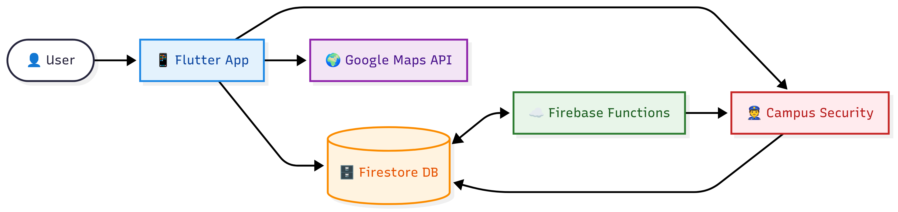

# JustBrightForUTM 🌞
<p align="center">
  
</p>  

## Table of Contents
- [Track & Problem Statement](#track--problem-statement-mag_right)  
- [Introduction](#introduction-mega)  
- [Core Features](#core-features-star2)  
- [Technical Stack](#technical-stack-computer)  
- [Setup Guide](#setup-guide-memo)  
- [Project Structure](#project-structure-)
- [System Architecture](#system-architecture-)  
- [Documentation](#documentation-)  
- [Contributors](#contributors-%E2%80%8D)  

---

## Track & Problem Statement :mag_right:  
**Track:**  CodeNection 2025 — Track 2: Campus Safety App  

**Problem Statement:**  
Universities often face **gaps in safety infrastructure** — from poor real-time responsiveness during emergencies, to a lack of inclusive mobility tools for students walking alone at night. Current systems are fragmented, reactive, and not student-centric.  

---

## Introduction :mega:  
**JustBrightForUTM** is a **Smart Campus Mobility & Safety Companion** built to empower students with confidence and protection on campus.  

Our mission is to eliminate the *fear of walking alone*, provide **instant emergency response**, and foster a **community-driven safety ecosystem**.  

The app delivers its value through **three main pillars**:  
1. **Intelligent Navigation & Community Mobility**  
2. **The Ultimate SOS Button**  
3. **Community Safety Ecosystem**
4. **Duress PIN**
5. **Hotlines & Resources Hub**
---

## Core Features :star2:  

### 1. Navigation & Community Mobility 🤳
- **Navigation**  
  1. **Alternative Route Calculation** 
     - Provides **estimated time of arrival (ETA)** so users can plan their journey more confidently.  
     - Offers **turn-by-turn navigation guidance**, ensuring users stay on the correct path at all times.  

  2. **Walk Alone Mode** 1️⃣🚶
     - AI Chat + Virtual Companion for reassurance.  
     - Option to play **pre-recorded family/friends’ voices** (embedded in app).  

- **Community Mobility**
  
  3. **“Let’s Walk!” Mode** 2️⃣🚶🚶🚶🚶🚶

     - **Navigation-based Matching** – pairs users heading in the *same or similar direction* using the route algorithm.
     - Temporary anonymous walking groups.   
     - In-app chat before and during the walk.  

### 2. The Ultimate SOS Button 🆘  
- **Stage 1: Smart Context Alert**  
  1. **Deterrent Mode (Single Tap)** – Loud alarm sound. 
  2. **Pre-Arming (Long Press)** – Emergency classification menu: Medical, Security, Fire Hazard, etc.  
  3. **Precise Dispatch** – Sends **GPS + emergency type** to campus security.  
  4. **Failsafe** – If no input in **5s**, escalates to **high-priority alert**.  

- **Stage 2: Live Guardian Mode :speaker:**  
  1. **One-Way Audio Stream** – Live audio feed to campus security.  
  2. **Real-Time Feedback** – Provides discreet reassurance to the user once an SOS alert is triggered.    
     - Displays a calming confirmation message such as *“Help is on the way”*.  
     - Display **real-time distance between the user and the assigned guard/security personnel**, giving the user confidence that help is approaching.
  3. **Ultimate Safeguard (Duress PIN)** – Fake cancel PIN that secretly escalates the alert.  

- **Manual Safety Guides**  
  - Quick instructions for **security**, **fire evacuation** and **medical emergencies**.  

### 3. Community Safety Ecosystem 📬  
- **Incident Reporting**  
  - **Report hazards** or suspicious activity with text, photo, or audio.  
  - **Status Tracking**: Submitted → In Progress → Completed/Rejected.  
  - **Urge for Update** if tracking status remains in **"Submitted"** more than 24h.  

- **Guard/Admin Dashboard**  
  - Categorized reports for faster action.  
  - Security can provide feedback directly to users.  

- **Campus News & Alerts**  
  - Scrollable, pinned safety news.  
  - **Live Feed** – Displays a record of the user’s **personal safety activity history**, including:  
    - Safe arrivals logged after walks.  
    - Participation in group walks.  
    - Submitted incident reports and their status updates.  
    - Emergency alerts triggered with resolution status updates.

- **Resources Hub**  
  - Emergency contacts & support channels in one place.  

### 4. Duress PIN 🔒

- A special PIN to deactivate an emergency alert, but secretly triggers a silent emergency alert to campus security.
- Useful in situations where the user is under **duress or threat** and cannot openly call for help (e.g., being forced to cancel an alert, unlock the app, or show compliance).  
- During **Live Guardian Mode** :  
  1. User enters the Duress PIN instead of the normal PIN when asked to deactivate.
  2. App appears to successfully deactivate the alert (looks normal to an observer).
  3. Keeps the interface looking normal and compliant to avoid suspicion.
  4. Meanwhile, the system continues Live Guardian Mode in the background (GPS tracking + audio monitoring) and sends a silent distress signal to campus security.

### 5. Hotlines & Resources Hub 📞
- One-tap quick access to:  
  - Campus Security  
  - Police  
  - Fire & Rescue  
  - Medical Services  
  - Emergency contacts
---
## Technical Stack :computer:  
- **Frontend**  
  - Flutter  

- **Backend**  
  - Firebase (Cloud Functions, Firestore, Authentication)  

- **Integrations**  
  - Google Maps Directions API (routing + ETA)  
  - Google Places API (location points)  
  - Google Geocoding API (address translation)  
  - Real-Time Audio Streaming  
  - Push Notifications (FCM)  
  - Gemini Developer Key (AI assistance)  

---

## Setup Guide :memo:
You can run **JustBrightForUTM** in by:  

- **Android**  
  1. Download APK file.
[](https://github.com/jiahui-1101/CodeNection/releases/tag/UTMBright)


  3. Tap the app icon to launch the app on your phone.


## Project Structure ⛓
```bash
CodeNection/
├── .dart_tool/                 # Auto-generated Dart tools and configs
├── .idea/                      # IDE project settings (for Android Studio/IntelliJ)
├── android/                    # Native Android project files
├── assets/                     # App resources (media, fonts, images)
│   ├── audio/                  # Audio files (alerts, notifications, etc.)
│   ├── fonts/                  # Custom fonts
│   ├── images/                 # App images, icons, illustrations
│   └── music/                  # Background or companion music
├── build/                      # Generated build output (do not edit manually)
├── functions/                  # Firebase Cloud Functions (backend logic)
├── lib/                        # Main application source code
│   ├── features/               # Core features organized by module
│   │   ├── map/                # Navigation & map features
│   │   │   ├── group/          # Group walking mode ("Let's Walk!")
│   │   │   ├── individual/     # Individual navigation & solo routes
│   │   │   └── main_features/  # Shared/central navigation functions
│   │   ├── news/               # Campus/community news module
│   │   │   ├── staff_view/     # Staff/admin-facing news views
│   │   │   └── user_view/      # User-facing news views
│   │   ├── register/           # User registration and onboarding
│   │   ├── report/             # Safety incident reporting system
│   │   │   ├── report/         # Core reporting logic
│   │   │   ├── staff_view/     # Staff/admin view for reports
│   │   │   ├── user_view/      # User view for submitted reports
│   │   │   └── widgets/        # Shared widgets for reporting UI
│   │   └── sos_alert/          # Emergency SOS alert feature
│   │       ├── guard_view/     # Security/guard-side interface
│   │       ├── service/        # SOS backend services (API, logic)
│   │       └── user_view/      # User-side SOS alert interface
│   ├── firebase/               # Firebase integration helpers
│   ├── pages/                  # General app pages
│   │   ├── staff/              # Pages specific to staff/admin roles
│   │   └── user/               # Pages specific to end-users
│   └── main.dart               # App entry point
├── test/                       # Unit and widget tests
├── .firebaserc                 # Firebase project configuration
├── .flutter-plugins-dependencies # Auto-generated plugin dependencies
├── .gitignore                  # Git ignore rules
├── .metadata                   # Flutter project metadata
├── analysis_options.yaml       # Linter & code analysis rules
├── devtools_options.yaml       # Dart/Flutter DevTools options
├── firebase.json               # Firebase hosting/deployment settings
├── flutter/                    # Flutter-related configs
├── pubspec.lock                # Locked package versions (auto-generated)
├── pubspec.yaml                # Project dependencies & metadata
└── README.md                   # Project documentation
```
---
## System Architecture 🪜
<p align="center">
  
</p>  

---

## Documentation 📃
- **User Guide:** 
- **Demo / Walkthrough:** https://youtu.be/3rg5cUewwSQ
- **Tech Stack:** Flutter :heavy_plus_sign: Firebase

---

## Contributors 👩🏼‍💻
- Team **JustBrightForUTM**

      🙋🏻‍♀️Lee Mei Shuet
      🙆🏻‍♀️Loh Su Ting
      🧏🏻‍♀️Wong Jia Hui
      💁🏻‍♀️Wong Zi Qi


